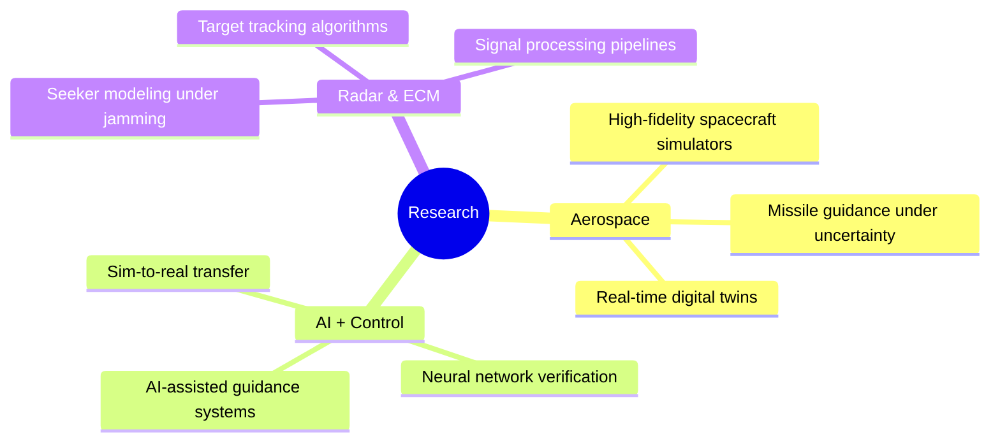

<!-- Animated Header -->
<div align="center">
  
</div>

<!-- Typing Animation -->
<div align="center">
  <a href="https://git.io/typing-svg">
    
  </a>
</div>

<!-- Profile Views & Social Badges -->
<div align="center">
  
  <a href="https://linkedin.com/in/mehmetgümüş">
    
  </a>
  <a href="mailto:spacegumus@gmail.com">
    
  </a>
  <a href="https://spacegumus.com.tr">
    
  </a>
</div>

<br/>

<!-- About Me Section -->


## 🧑‍🚀 About Me

```yaml
name: Mehmet Gümüş
located_in: Istanbul, Turkey
current_role: AI Trainer @ Invisible Technologies
founder: Bilir.app

engineering_mindset:
  - physics_first
  - simulation_driven
  - performance_oriented
  - system_level_thinking

fields_of_interests:
  - Aerospace & Defense Software
  - AI/ML & LLM Fine-tuning
  - Real-time Physics Simulations
  - 3D Visualization & WebGL
  - Embedded Systems & Robotics
  - Radar & Signal Processing

currently_working_on:
  - LLM validation & RLHF
  - Space mission simulators
  - Missile guidance systems

fun_fact: "I build rockets in software before they fly in reality"
```

<br clear="both"/>

---

## 🚀 Featured Projects

<div align="center">

<!-- Project Cards -->
| 🛰️ **Orbiter (TLM-1)** | 🧠 **EnSim** |
|:---:|:---:|
| Full-Stack Space Mission Simulator | Rocket Engine Performance Simulator |
| `Electron` `React` `FastAPI` `Three.js` | `Python` `PyQt6` `Numba` `PyVista` |
| Turkish Lunar Mission scenarios | NASA CEA thermochemical calculations |
| 20+ REST API endpoints | JIT-optimized performance |

| 🎯 **Supercruise** | 📡 **RadarSim / Siper Block-2** |
|:---:|:---:|
| Missile Guidance & 6-DOF Simulation | Radar Seeker Head Simulator |
| `React Three Fiber` `WebGL` `Zustand` | `C++` `Python` `DSP` `Kalman/UKF` |
| RK4 physics integration | Monopulse angle tracking |
| Real-time guidance dynamics | ECM & Doppler analysis |

</div>

---

## 🧠 Engineering Philosophy

<div align="center">

| Principle | Description |
|:---|:---|
| 🎯 **Design before code** | Understand the problem space before writing a single line |
| 🔬 **Simulate before build** | Physics-based models over black-box assumptions |
| 📊 **Measure uncertainty** | Deterministic systems with quantified error bounds |
| ⚡ **Profile critical paths** | Performance-critical code is always benchmarked |
| 🛡️ **Fail safely** | Real-time systems must fail gracefully, not silently |

</div>

---

## 🛰️ Simulation Expertise

<div align="center">

```
┌─────────────────────────────────────────────────────────────────┐
│  🎮 SIMULATION PIPELINE                                         │
├─────────────────────────────────────────────────────────────────┤
│  ┌──────────────┐    ┌──────────────┐    ┌──────────────┐       │
│  │  PHYSICS     │───▶│  STATE EST.  │───▶│  CONTROL     │       │
│  │  6-DOF       │    │  KF/EKF/UKF  │    │  PID/Adaptive│       │
│  └──────────────┘    └──────────────┘    └──────────────┘       │
│         │                   │                   │               │
│         ▼                   ▼                   ▼               │
│  ┌──────────────┐    ┌──────────────┐    ┌──────────────┐       │
│  │  RK4/Verlet  │    │  Monte Carlo │    │  Stability   │       │
│  │  Integrators │    │  Propagation │    │  Analysis    │       │
│  └──────────────┘    └──────────────┘    └──────────────┘       │
└─────────────────────────────────────────────────────────────────┘
```

</div>

**Core Competencies:**
- 6-DOF rigid body dynamics & kinematics
- Numerical integration (RK4, Verlet, adaptive solvers)
- Monte Carlo uncertainty propagation
- State estimation (Kalman, EKF, UKF)
- Control loop stability analysis
- Sensor noise & bias modeling

---

## 🤖 AI Engineering Scope

<div align="center">

| Domain | Focus Areas |
|:---|:---|
| **LLM Engineering** | Evaluation pipelines, RLHF, prompt robustness, hallucination analysis |
| **Data Engineering** | Synthetic data generation, feature engineering for noisy datasets |
| **ML Systems** | Classical ML for sensor classification, model validation |
| **Deployment** | Statistical metrics, A/B testing, production monitoring |

</div>

---

## ⚙️ Embedded & Control Systems

<div align="center">

```
  ┌─────────────────────────────────────────────────────────────┐
  │                    CONTROL ARCHITECTURE                      │
  └─────────────────────────────────────────────────────────────┘
                              │
       ┌──────────────────────┼──────────────────────┐
       ▼                      ▼                      ▼
  ┌─────────┐           ┌─────────┐           ┌─────────┐
  │ SENSORS │           │ CONTROL │           │ACTUATORS│
  │ IMU/GPS │──────────▶│  PID    │──────────▶│ Motors  │
  │ Radar   │           │ Adaptive│           │ Servos  │
  └─────────┘           └─────────┘           └─────────┘
       │                      │                      │
       └──────────────────────┴──────────────────────┘
                         FEEDBACK LOOP
```

</div>

- Flight controller logic design
- Adaptive PID & gain scheduling
- Real-time sensor fusion algorithms
- Hardware-in-the-loop (HIL) testing mindset
- Low-level protocols: UART, I2C, SPI, CAN
- Control-oriented software architecture

---

## ❌ What I Don't Do

<div align="center">

| ❌ Anti-Pattern | ✅ My Approach |
|:---|:---|
| Blindly trust AI outputs | Validate with domain knowledge |
| Simulations without physics | Ground truth from first principles |
| Premature optimization | Profile first, optimize bottlenecks |
| Ship without observability | Logging, metrics, failure analysis |
| Copy-paste solutions | Understand, adapt, then implement |

</div>

---

## 🔬 Current Research Interests

<div align="center">



</div>

---

## 🛠️ Tech Stack

<!-- AI & Data -->
<details open>
<summary><b>🧠 AI & Data Science</b></summary>
<br/>
<div align="center">
  


</div>
</details>

<!-- Backend & Desktop -->
<details open>
<summary><b>💻 Backend & Desktop</b></summary>
<br/>
<div align="center">
  


</div>
</details>

<!-- Frontend & 3D -->
<details open>
<summary><b>🌐 Frontend & 3D Visualization</b></summary>
<br/>
<div align="center">
  


</div>
</details>

<!-- Embedded Systems -->
<details open>
<summary><b>⚙️ Embedded Systems</b></summary>
<br/>
<div align="center">
  


</div>
</details>

<!-- Tools -->
<details open>
<summary><b>🛠️ DevOps & Tools</b></summary>
<br/>
<div align="center">
  


</div>
</details>

---

## 📊 GitHub Statistics

<div align="center">
  
  <!-- GitHub Stats Card -->
  
  
  <!-- Top Languages -->
  
  
</div>

<div align="center">
  
  <!-- Streak Stats -->
  
  
</div>

<!-- Activity Graph -->
<div align="center">
  
</div>

---

## 🏆 Profile Summary

<div align="center">
  
</div>

<div align="center">
  
  
  
</div>

---

## 🐍 Contribution Snake

<div align="center">
  <picture>
    <source media="(prefers-color-scheme: dark)" srcset="https://raw.githubusercontent.com/SpaceEngineerSS/SpaceEngineerSS/output/github-contribution-grid-snake-dark.svg" />
    <source media="(prefers-color-scheme: light)" srcset="https://raw.githubusercontent.com/SpaceEngineerSS/SpaceEngineerSS/output/github-contribution-grid-snake.svg" />
    
  </picture>
</div>

---

## 💼 Experience Highlights

<div align="center">

| 🏢 Role | 📍 Organization | 📅 Period |
|:---|:---|:---:|
| **AI Trainer** (Turkish Language Specialist) | Invisible Technologies | 2025 - Present |
| **Founder & System Architect** | Bilir.app | 2024 - Present |
| **Embedded Software Team Lead** | UKET (Volunteer) | Current |
| **Software Development Intern** | TÜBİTAK MAM | 2023 |

</div>

---

## 🎯 Core Competencies

<div align="center">

```
 ╔════════════════════════════════════════════════════════════════════╗
 ║  🧠 AI/ML          ████████████████████████████████████░░ 95%      ║
 ║  🚀 Simulations    █████████████████████████████████████░ 97%      ║
 ║  💻 Full-Stack     ██████████████████████████████████░░░░ 88%      ║
 ║  ⚙️  Embedded       ████████████████████████████████░░░░░░ 85%      ║
 ║  📡 Signal/Radar   ██████████████████████████████░░░░░░░░ 80%      ║
 ║  🎨 3D/WebGL       █████████████████████████████████░░░░░ 90%      ║
 ╚════════════════════════════════════════════════════════════════════╝
```

</div>

---

## 📫 Let's Connect!

<div align="center">
  
  <a href="https://linkedin.com/in/mehmetgümüş">
    
  </a>
  <a href="mailto:spacegumus@gmail.com">
    
  </a>
  <a href="https://spacegumus.com.tr">
    
  </a>

</div>

<br/>

<div align="center">
  
</div>

---

<!-- Animated Footer -->
<div align="center">
  
</div>

<div align="center">
  
  **"First, solve the problem. Then, write the code."** - John Johnson
  
  ⭐ From [SpaceEngineerSS](https://github.com/SpaceEngineerSS) with 🚀
  
</div>
